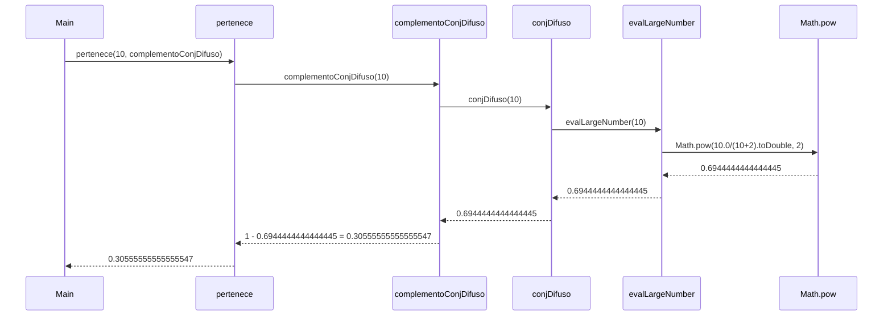

# Informe de proceso Algoritmo para definir si un número es grande
## Definición del Algoritmo
```Scala
 def complemento(c: ConjDifuso): ConjDifuso = {
  x => 1.0 - c(x)
}
```
* sea el tipo ConjDifuso una función que recibe un entero y retorna un valor real.
* la función de alto orden `complemento` retorna otra función que se define de forma anonima y representa en el concepto de
conjuntos difusos, el complemento de un valor para llegar a cumplir a cabalidad con la carácteristica definida. recibe una
función como parametro.
    * `c`: es la función que se redefine en la función anónima restandole 1 para conoce el complemento del numero x a evaluar
    dentro del conjunto difuso.


## Llamados de pila
Ejemplo:
```Scala
val conjDifuso = grande(2,2) //d=2 y e=2 Math.pow(n.toDouble/(n+2).toDouble,2)
val complementoConjDifuso = complemento(conjDifuso)
```
### Paso 1: Llamada mediante función de alto orden pertenece
```Scala
pertenece(10, complementoConjDifuso)
```
### Paso 2: Evaluación de pertenece
```Scala
complementoConjDifuso(10)
```
### Paso 3: Evaluación de función complementoConjDifuso
```Scala
1 - conjDifuso(10)
```
### Paso 4: Evaluación de función conjDifuso
```Scala
evalLargeNumber(10) // n>0
```
### Paso 5: Evaluación de función evalLargeNumber
```Scala
Math.pow(n.toDouble/(n+2).toDouble,2)
```
### Paso 6: Evaluación de función evalLargeNumber - se reemplaza n en el numerador
```Scala
Math.pow((10).toDouble/(n+2).toDouble,2)
```
### Paso 7: Evaluación de función evalLargeNumber - n del numerador pasa a ser double
```Scala
Math.pow(10.0/(n+2).toDouble,2)
```
### Paso 8: Evaluación de función evalLargeNumber - se reemplaza n del denominador
```Scala
Math.pow(10.0/(10+2).toDouble,2)
```
### Paso 9: Evaluación de función evalLargeNumber - se suman los valores del denominador
```Scala
Math.pow(10.0/(12).toDouble,2)
```
### Paso 10: Evaluación de función evalLargeNumber - el denominador pasa a ser double
```Scala
Math.pow(10.0/12.0,2)
```
### Paso 11: Evaluación de función evalLargeNumber - se resuelve la división
```Scala
Math.pow(0.8333333333333334,2)
```
### Paso 12: Evaluación de función evalLargeNumber - se resuelve la potencia
```Scala
0.6944444444444445
```
### Paso 13: Se devuelve el resultado a la evaluación de función complementoConjDifuso
```Scala
1 - 0.6944444444444445
```
### Paso 14: Se resuelve complementoConjDifuso y se retorna el resultado
```Scala
0.30555555555555547
```

## Ejemplo de uso

```Scala
val conjDifuso = grande(2,2)
val complementoConjDifuso = complemento(conjDifuso)
println(complementoConjDifuso(10))  // 0.30555555555555547
```


## Diagrama de llamados




