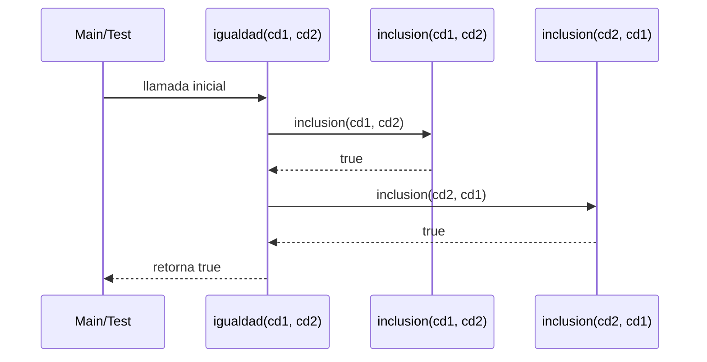

# Informe de proceso función `igualdad()`


## Definición del algoritmo

Dados $S_1$ y $S_2$ dos conjuntos difusos, la definición de igualdad está dada por:

$$
S_1 = S_2 \iff S_1 \subseteq S_2 \land S_2 \subseteq S_1
$$

Es decir, el grado de pertenencia de cada elemento a $S_1$ es menor o igual al grado de pertenencia de ese mismo elemento a $S_2$ 
y a su vez, el grado de pertenencia de cada elementos a $S_2$ es menor o igual al grado de pertenencia de ese mismo elemento a $S_1$

## Implementación en Scala


```scala
def igualdad(cd1: ConjDifuso, cd2: ConjDifuso): Boolean = {
  inclusion(cd1, cd2) && inclusion(cd2, cd1)
}
```

- La funcion `igualdad` recibe dos conjuntos difusos `ConjDifuso`, cada uno representado como una función de tipo abstracto de dato que recibe un entero y retorna un double.

- Esta función devuelve un valor booleano `true` si verifica que son iguales, en caso contrario, devuelve `false`

- Se apoya en la función `inclusión` que evalúa si un conjunto difuso está contenido en el otro.

    - `inclusion(cd1, cd2)`: verifica si `cd1` esta dentro de `cd2`.
    - `inclusion(cd2, cd1)`: verifica si `cd2` está dentro de `cd1`
    - El operador `&&` asegura que ambas inclusiones se cumplan.

    
    
## Llamados de pila

### Paso 1: Llamada inicial

```scala
igualdad(cd1, cd2)
```

### Paso 2: Ejecución de la primera inclusión

```scala
inclusion(cd1, cd2) // true
```
Para conocer a  detalle la ejecución de esta función ir a [Proceso Inclusion](ProcesoInclusion.md).

### Paso 3: Ejecución de la segunda inclusión

```scala
inclusion(cd2, cd1) // true
```
Para conocer a  detalle la ejecución de esta función ir a [Proceso Inclusion](ProcesoInclusion.md).

### Paso 4: Comparación

```scala
true && true // return true
```

### Ejemplo de uso

```scala
val cDif1 = conjuntosDifusos.grande(5,2)
val cDif2 = conjuntosDifusos.grande(5,2)
conjuntosDifusos.igualdad(cDif1, cDif2) // true
```


## Diagrama de llamados de pila

