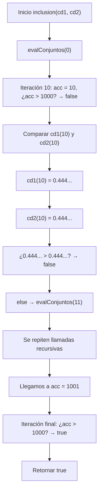

# Informe de proceso Algoritmo para el la operacion de inclisión en conjuntos difusos
## Definición del Algoritmo

```scala
 def inclusion(cd1: ConjDifuso, cd2: ConjDifuso): Boolean = {
  @tailrec
  def evalConjuntos(acc : Int) : Boolean = {
    if(acc > 1000) true
    else if (this.pertenece(acc, cd1) > this.pertenece(acc, cd2)) false
    else evalConjuntos(acc + 1)
  }
  evalConjuntos(0)
}
```
* sea el tipo ConjDifuso una función que recibe un entero y retorna un valor real.
* la función de alto orden `inclusion` retorna un valor Booleano que confirma si un conjunto difusos se encuentra dentro del otro,
para ello, recibe dos funciones como parametro de tipo ConjDifuso.
  * `cd1`: representa al conjunto difuso que será evaluado para confirmar si esta dentro de `cd2`.
  * `cd2`: es el conjunto con el que servirá como evaluador.

* la función auxiliar `evalConjuntos` se encarga, mediante recursion de cola, de verificar si los valores puestos en `cd1`
son menores o iguales al mismo valor puesto en `cd2`, que es lo planteado por Zadeh para verificar esta comparación entre
conjuntos difusos. solamente recibe un parámetro, el cual se fija en 0.
  * `acc`: para este caso solo se trabaja con el acumulador, que es el número entero a evaluar en cada conjunto difuso.
* El decorador `@annotation.tailrec` obliga a que la función sea optimizada como recursión de cola, es decir, **no se acumulan llamados en la pila**.

## Explicación paso a paso

### Caso base de éxito

```Scala
if(acc > 1000) true
```

Cuando `acc` llega a `1001`, la función retorna true y con ello, corta la recursividad y se confirma que `cd1` está en `cd2`.

### Caso base de falla

```Scala
else if (this.pertenece(acc, cd1) > this.pertenece(acc, cd2)) false
```
se evalua `acc` en cada conjunto difuso mediante la función pertenece y se verifica que el resultado de `cd1` sea menor o igual a `cd2`.
si resulta que el resultado del conjunto ``cd1`` es mayor al del `cd2` se retorna `false` cortando la recursividad y negando que el primer
conjunto se encuentra en el segundo.

### Caso recursivo

```Scala
else evalConjuntos(acc + 1)
```
Al ser recursión de cola, la llamada recursiva es la última instrucción, y en este caso solo se  aumenta `acc` en 1 y se pasa a la siguiente operación.

## Llamados de pila en recursión de cola

Ejemplo:

```Scala
val cDif1 = conjuntosDifusos.grande(5,2)
val cDif2 = conjuntosDifusos.grande(5,2)
conjuntosDifusos.inclusion(cDif1, cDif2)
```

### Paso 1: Llamada inicial

```Scala
evalConjuntos(0)
```

### Paso 2: Onceava iteración

```Scala
if(acc > 1000) true // acc == 10
else if (this.pertenece(acc, cd1) > this.pertenece(acc, cd2)) false //ingresa en la evaluación
else evalConjuntos(acc + 1) // espera a la verificación del else anterior
```
Dado que para todos los conjuntos difusos el valor incial 0 es el mismo, se salta a la iteración 10 para
tener un ejemplo más representativo.

### Paso 3: Onceava iteración - ejecución de pertenece para el primer conjunto

```Scala
else if (cd1(acc) > this.pertenece(acc, cd2)) false 
```

### Paso 4: Onceava iteración - Se reemplaza acc para el primer conjunto
```Scala
else if (cd1(10) > this.pertenece(acc, cd2)) false // cd1(10) == 0.4444444444444444
```
para información sobre el proceso a ejecutar en el primer conjunto ir a [Proceso Grande](ProcesoGrande.md), puesto que es en este
se explica a detalle el paso a paso para ello. este toma 3 pasos, por ende saltamos al paso 8.

### Paso 8: Onceava iteración - Se coloca el primer resultado
```Scala
else if (0.4444444444444444 > this.pertenece(acc, cd2)) false 
```
se repiten los pasos del 3 hasta el 7 para la evaluación del segundo conjunto difuso, por lo cual se salta al paso 14.

### Paso 14: Onceava iteración - Se coloca el segundo resultado
```Scala
else if (0.4444444444444444 > 0.4444444444444444) false 
```
### Paso 15: Onceava iteración - Se evalua la condición
```Scala
else if (false) false 
```
### Paso 16: Onceava iteración - Se pasa el caso recursivo
```Scala
else evalConjuntos(acc + 1)
```
### Paso 16: Onceava iteración - Se reemplaza acc
```Scala
else evalConjuntos(10 + 1)
```

### Paso 16: Onceava iteración - Se realiza la suma
```Scala
else evalConjuntos(11)
```
### Paso cuarto por el final: milésima segunda iteración

```Scala
if(acc > 1000) true // acc == 1001
```
Para efectos prácticos se salta a la última iteración del ejercicio que es donde se confirma
que se evaluo el rango comprendido [0,1000] dando a entender que el primer conjunto se encuentra 
incluido en el segundo.

### Paso antepenúltimo: milésima segunda iteración se reemplaza acc

```Scala
if(1001 > 1000) true 
```
### Paso penúltimo: milésima segunda iteración se evalua la condición

```Scala
if(true) true
```
### Paso final: resultado

```Scala
true
```


## Ejemplo de uso

```Scala
val cDif1 = conjuntosDifusos.grande(5,2)
val cDif2 = conjuntosDifusos.grande(5,2)
println(conjuntosDifusos.inclusion(cDif1, cDif2)) //true
```


## Diagrama de llamados
