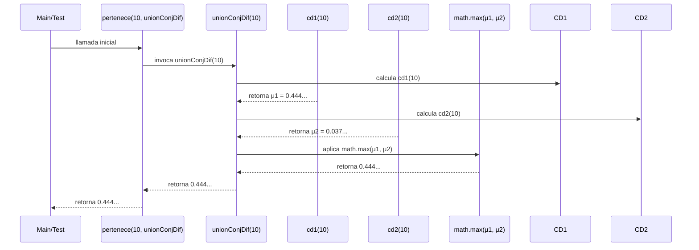

# Informe de proceso función `union()`


## Definición del algoritmo

La unión de dos conjuntos difusos $S_1$ y $S_2$ se define como:

$$
f_{S_1 \cup S_2} = max(f_{S_1}, f_{S_2})
$$


## Implementación en Scala


```scala
def union(cd1: ConjDifuso, cd2: ConjDifuso): ConjDifuso = {
  x => math.max(cd1(x), cd2(x))
 }
```

- La función `union` recibe dos conjuntos difusos de enteros y devuelve el conjunto difuso con mayor grado de pertenencia.

- Cada conjunto difuso está representado como una función de tipo abstracto de dato: `type ConjDifuso = Int => Double`
donde la entrada es un elemento que pertenece a los numeros enteros y la salida es el grado de pertenencia de ese elemento.


  
## Ejemplo


```scala
val cd1 = grande(5,2)
val cd2 = grande(20, 3)
val unionConjDif = union(cd1, cd2)

println(unionConjDif(10)) //0.4444...
```


## Explicación paso a paso

**Paso 1.** Se reciben dos conjuntos difusos `cd1` y `cd2`

**Paso 2.** Para `x = 10`: se evalua como pertenece este numero a `cd1` y `cd2`

- `cd1(10)` = $(10/15)^2$ = 0.444444...
- `cd2(10)` = $(10/30)^3$ = 0.037037...

**Paso 3.** Se aplica `max(cd1(10), cd2(10))` compara y retorna el valor mayor. 
Por lo tanto, el resultado de `unionConjDif(10) = 0.4444...`

Es decir que, el grado de pertenencia de 10 en la unión es 0.4444... ya que al menos en uno de los dos conjuntos ese elemento tiene esa pertenencia.


## Llamados de pila


En esta función, se hacen llamadas anidadas a las funciones puras `cd1` y `cd2`

Ejemplo:

```scala
val cd1 = grande(5,2)
val cd2 = grande(20, 3)
val unionConjDif = union(cd1, cd2)
```

### Paso 1: Llamada inicial

```scala
pertenece(10, unionConjDif)
```

### Paso 2: Evaluación en pertenece

```scala
unionConjDif(10) // s(elem)
```

### Paso 3. Evaluación de la unión

```scala
math.max(c1(10), c2(10))
```

### Paso 4. Evaluación del primer conjunto

```scala
cd1(10) = (10 / (10 + 5))^2 = 0.44444
```

### Paso 5. Evaluación del segundo conjunto

```scala
cd2(10) = (10 / (10 + 20))^3 = 0.037037
```

### Paso 6. Calcular el máximo

```scala
math.max(0.444444, 0.037037)
return 0.4444
```

Las llamadas son anidadas porque se necesita invocar a otras funciones dentro de su ejecución para producir un resultado.


## Diagrama de llamados de pila

