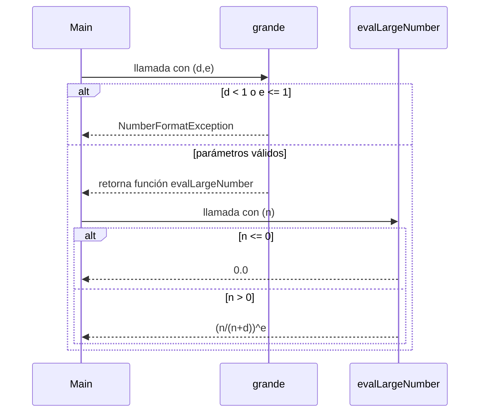

# Informe de proceso Algoritmo para definir si un número es grande
## Definición del Algoritmo
```Scala
 def grande(d: Int, e: Int): ConjDifuso = {
  def evalLargeNumber(n: Int): Double ={
    if(n <= 0) 0.0
    else Math.pow(n.toDouble/(n+d).toDouble,e)
  }
  if(d < 1 || e <= 1) throw new NumberFormatException("primer parametro debe ser mayor o igual a 1, segundo parametro debe ser mayor a 1")
  else evalLargeNumber
}
```
* la función de alto orden `grande` retorna la función `evalLargeNumber` y recibe como parametros dos enteros que deben cumplir ciertas condiciones, de
lo contrario se lanzará una excepción.
    * `d`: hace que la función tenga un crecimiento menos pronunciado para converger en 1.
        debe ser un número pequeño mayor o igual a 1 ya que suma al denominador, si es 0 se vuelve constante igual a 1,
        y si es menor a cero resta al denominador haciendo que la función tome un comportamiento decreciente y convergente en 1
    * `e`: exponente que ayuda a que la pendiente en el punto de inflexión sea menos pronunciada. 
        Se debe emplear un número mayor a 1, si es uno no corrige el grado de pertenencia, si es 0 se vuelve constante en 1
        y si es menor a 0 adopta un comportamiento decreciente que converge en 1 en el infinito.
* por su lado `evalLargeNumber` se encarga de aplicar la función $$ f(n) = \left(\frac{n}{n+d}\right)^e $$ y recibe un parámetro:
    * `n`: es el número a evaluar si es grande en conjunto con los parámetros pasados a la funcion de alto orden `grande`. debe ser
      mayor a 0, de lo contrario retorna 0.

## Explicación paso a paso

### Evaluación en la función de alto orden

```Scala
if(d < 1 || e <= 1) throw new NumberFormatException("primer parametro debe ser mayor o igual a 1, segundo parametro debe ser mayor a 1")
```
Evalua si los enteros dados como parámetros cumplen con las condiciones descritas anteriomente.

```Scala
else evalLargeNumber
```
si se cumplen las condiciones, se retorna la función evalLargeNumber

### Evaluación en la función retornada
```Scala
if(n <= 0) 0.0
```
Cuando se ejecuta la función retornada con el parámetro a evaluar, se verifica incialmente si es mayor a cero.
```Scala
else Math.pow(n.toDouble/(n+d).toDouble,e)
```
si se cumple dicho requerimiento, se procede a operar y retornar el valor respectivo.

## Llamados de pila 
Ejemplo:
```Scala
val conjDifuso = grande(2,2)
```
### Paso 1: Llamada con parámetro

```Scala
conjDifuso(10)
```
### Paso 2: Evaluación

```Scala
else Math.pow(n.toDouble/(n+d).toDouble,e) // (10/(10+2))^2
```
### Paso 2: Resultado

```Scala
return 0.6944444444
```

## Ejemplo de uso

```Scala
val conjDifuso = grande(2,2)
println(conjDifuso(10))  // 0.6944444444
```


## Diagrama de llamados




